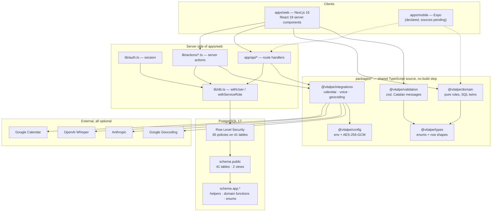
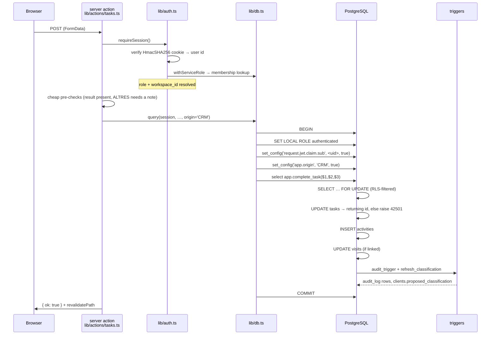
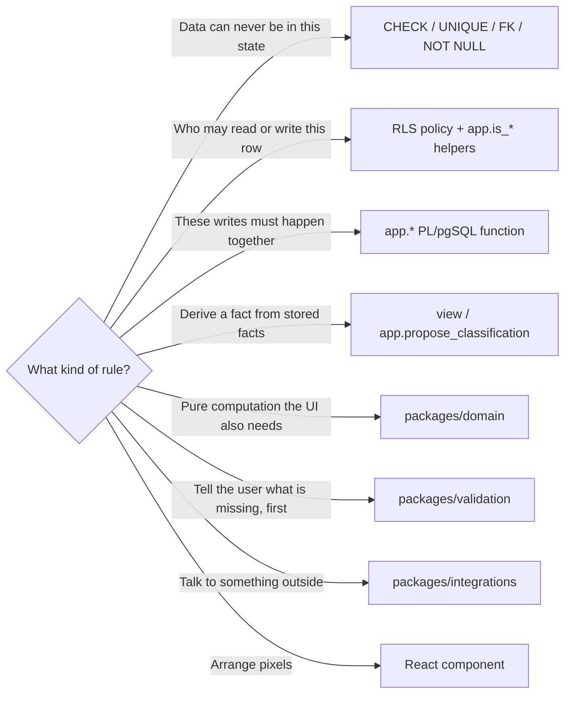
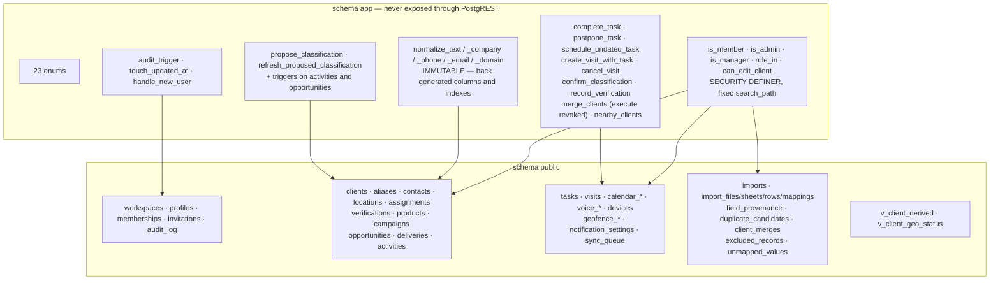
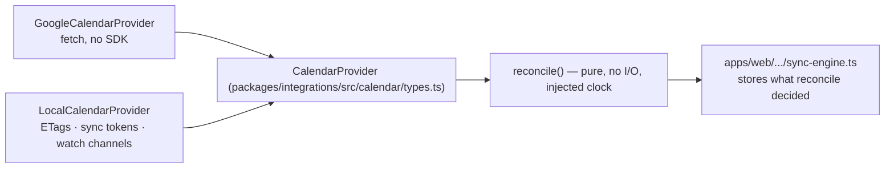

# ARCHITECTURE

The shape of the system, and where each kind of decision is allowed to live.

---

## 1. The one-sentence version

Business rules live in PostgreSQL and in pure TypeScript functions that mirror
it; the web app and the phone are transport and presentation; Row Level Security
is the security boundary for every backend, local or hosted.

---

## 2. Layers

Dotted edges are declared but not yet implemented (`apps/mobile` has a
`package.json` and no sources).

---

## 3. The request path

A user clicks «Marcar com a feta» on a task.

Four things are load-bearing here.

1. **The session is only an identity.** `getSession()` reads a signed HttpOnly
   cookie, verifies it in constant time, and then looks up the membership. That
   lookup is the *only* thing outside `withServiceRole`'s stated purpose that
   uses it, and it has to: the user's own RLS context cannot be established
   before we know which workspace they belong to.
2. **Authorisation is not in the action.** The pre-checks in the server action
   are a courtesy so the user gets a Catalan sentence without a round trip. The
   decision is `tasks_update`'s `USING`/`WITH CHECK` clause and
   `app.complete_task`'s explicit refusal.
3. **The transaction carries context.** `app.origin`, `app.device` and
   `app.correlation_id` are transaction-scoped settings read by
   `app.audit_trigger()`, so every audited row records *where* the change came
   from without any table carrying those columns.
4. **The domain function is atomic.** Closing a task and writing its history is
   one statement, so the history cannot develop holes.

### 3.1 The two backends

`lib/db.ts` picks a backend once per process:

| `DATABASE_URL` | Backend | Used for |
| --- | --- | --- |
| set | `postgres.js` against Supabase/Postgres | hosted |
| unset | PGlite persisted in `.data/crm` | local development, no credentials |

The SQL sent is identical, the role switching is identical, the policies are
identical. See [`DECISIONS.md` §3](DECISIONS.md#3-the-web-app-talks-to-postgres-directly-not-through-postgrest)
for the known limit on connection pinning with `postgres.js`.

### 3.2 The only service-role paths

`withServiceRole()` resets the role, so RLS does not apply. It is used in exactly
these places, and nowhere else:

| Caller | Why |
| --- | --- |
| `lib/auth.ts` → `getSession()` | Membership lookup that establishes the RLS context |
| `app/api/google/callback` | Writes `access_token_enc` / `refresh_token_enc`, which are revoked at column level |
| `app/api/google/sync-engine.ts` | Reads and refreshes those tokens; processes webhooks that arrive with no user session |
| `scripts/import/*` | Runs as a maintenance job, not on behalf of a user |

---

## 4. Where a rule is allowed to live

The direction is one-way: a React component may call down through any of the
others, but no rule may move *up*. Concretely:

| Rule | Lives in | Also mirrored in |
| --- | --- | --- |
| A company named `X` can exist once per workspace | `clients_name_norm_uq` | — |
| `ALTRES` company type needs an explanation | `clients_other_type_needs_explanation` | `packages/validation/src/crm.ts` |
| A `COMERCIAL` may only edit assigned companies | `clients_update` + `app.can_edit_client` | `isManager()` for UI affordances only |
| Completing a task writes history | `app.complete_task` | `packages/domain/src/taskRules.ts` (pre-check) |
| Proposed classification | `app.propose_classification` | `packages/domain/src/classification.ts` |
| Last contact, pending/overdue tasks, next visit | `v_client_derived` | — |
| Which 20 geofences to register | — | `packages/domain/src/geofence.ts` (only there) |
| Whether two companies may auto-merge | — | `packages/domain/src/dedupe.ts` (only there) |

Two rules exist only in TypeScript, and that is deliberate: geofence selection is
a device concern the database has no reason to know about, and the dedupe score
is an advisory input to a human queue, not a constraint.

Everything that exists **twice** says so in its file header and is covered by
`supabase/tests/parity.test.ts` or by a transcription test.

---

## 5. The database in more detail

41 tables, 2 views, 65 policies, 35 `app.*` functions, 6 migrations. Full
description in [`DATA_MODEL.md`](DATA_MODEL.md).

**Migration order matters** and is encoded in the filenames:

| File | Adds |
| --- | --- |
| `20260723090000_core.sql` | `pg_trgm`, schema `app`, enums, normalisation functions, workspaces/profiles/memberships/invitations, audit log, session-context readers |
| `20260723091000_crm.sql` | company types, clients + aliases + contacts + locations + assignments + verifications, products/aliases/campaigns, opportunities + deliveries, activities |
| `20260723092000_ops.sql` | tasks, visits, Google Calendar tables, voice notes and proposals, devices, geofencing, notification settings, offline queue |
| `20260723093000_imports.sql` | imports, staging, provenance, dedupe queue, merge journal, exclusions, unmapped values |
| `20260723094000_domain.sql` | classification engine, `v_client_derived`, the transactional operations, geodesy |
| `20260723095000_rls.sql` | `ENABLE ROW LEVEL SECURITY` on all 41 tables, 65 policies, column-level grants, function-level grants/revokes |

---

## 6. Integrations: a port, a real adapter, and a real local adapter

The same pattern is repeated for voice (`OpenAIWhisperProvider` /
`LocalTranscriptionProvider`, `AnthropicInterpreter` / `LocalInterpreter`) and
geocoding (`GoogleGeocodingProvider` / `NullGeocodingProvider`). The factory
functions (`createTranscriptionProvider`, `createInterpreter`,
`createGeocodingProvider`) **never throw**: a missing credential selects the
local adapter, which is a supported state and not an error.

Two properties hold across the whole package:

- Every network adapter takes an injectable `fetch` and `Clock`, so no test
  touches the network or the real time.
- All diagnostic output goes through `redact()`, which scrubs credential-shaped
  substrings out of upstream error text as well as out of object keys — Google
  will happily echo an access token back inside `error.message`.

---

## 7. The web app

- **Next.js 16, App Router, React 19.** Server components by default; `'use
  client'` only where interaction demands it.
- **Route groups.** `(app)` is the authenticated shell (`layout.tsx` calls
  `requireSession()`); `entrar` is the sign-in page; `api/*` are route handlers.
- **Mutations are server actions** in `lib/actions/*.ts`, each returning
  `{ ok, error? }`. They validate cheaply, call a domain function or a plain
  statement through `query(session, …)`, and translate failures with
  `friendlyError()`.
- **Filters live in the URL.** `app/(app)/clients/filters.ts` parses the query
  string and builds the SQL, and the same builder feeds the page and the CSV
  export route — so the export can never disagree with what is on screen.
- **`serverExternalPackages: ['@electric-sql/pglite', 'postgres']`** because
  PGlite ships a WASM binary that must not be bundled.
- **`experimental.externalDir: true`** so the workspace packages compile from
  source.
- Type errors fail the build (`typescript.ignoreBuildErrors: false`); ESLint does
  not (`eslint.ignoreDuringBuilds: true`, and there is no ESLint config in the
  repository anyway).

---

## 8. What is not here yet

| Piece | State |
| --- | --- |
| `apps/mobile` sources | Only `package.json` (Expo 57, expo-location, expo-task-manager, expo-notifications, expo-audio, expo-secure-store, expo-router) |
| Several `(app)` routes | The sidebar lists `CALENDARI`, `TASQUES` and the seven `ADMINISTRACIÓ` entries; not all have a page yet. Check `PROGRESS.md`. |
| Field-level provenance writes | Table and writer exist; the writer is never fed |
| Import undo | Schema supports it; nothing performs it |
| `supabase/functions` | Empty directory |
