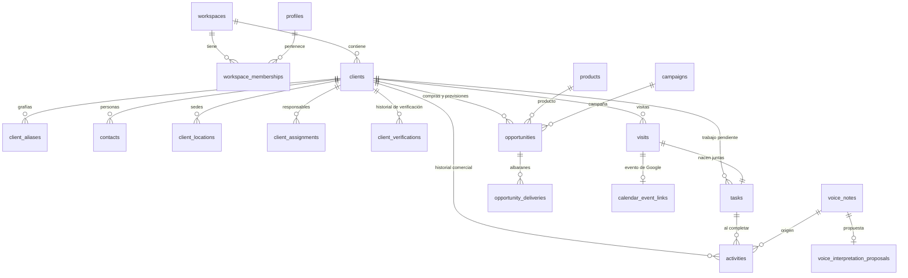

# DATA_MODEL

**41 tablas de aplicación** (más `schema_migrations`, que es infraestructura del
arranque local), **2 vistas derivadas**, **65 políticas RLS** y **35 funciones**
en el esquema `app`. Todas las tablas de `public` tienen RLS activa;
`pnpm db:local` falla si alguna no la tiene.

Convenciones transversales:

- Toda entidad comercial lleva `workspace_id`.
- El borrado es **lógico** (`deleted_at`), nunca físico, salvo el borrado
  explícito de empresa por un ADMIN.
- Las columnas `*_norm` son **generadas** (`GENERATED ALWAYS AS … STORED`) a
  partir de las funciones `app.normalize_*`: no se pueden escribir a mano y no
  pueden desincronizarse del valor original.
- Los enums viven en el esquema `app`; las listas ampliables (tipos de empresa,
  productos, campañas) son **tablas**, no enums.

---

## Diagrama del núcleo



---

## 1. Espacio de trabajo e identidad

| Tabla | Cols | Para qué |
| --- | ---: | --- |
| `workspaces` | 8 | Frontera de tenencia. `slug`, `timezone`, `locale`, `settings` |
| `profiles` | 11 | 1:1 con `auth.users`, creado por *trigger* al registrarse |
| `workspace_memberships` | 11 | Rol y estado. `extra_permissions jsonb` reservado para permisos granulares |
| `workspace_invitations` | 14 | `token_hash` (nunca el token), caducidad, estado. Índice único de "una pendiente por correo" |

**Restricción clave:** la política de escritura de `workspace_memberships` exige
`app.is_admin()` en `USING` **y** en `WITH CHECK`; el segundo se evalúa sobre la
fila nueva, así que nadie puede ascenderse.

## 2. Empresas y satélites

| Tabla | Cols | Notas |
| --- | ---: | --- |
| `clients` | 37 | Fila canónica. `name_norm`, `tax_id_norm`, `website_domain` generadas |
| `client_aliases` | 8 | **Toda** grafía vista se conserva. `alias_norm` generada |
| `contacts` | 18 | Varios por empresa. `phone`/`email` normalizados junto al original |
| `client_locations` | 25 | Dirección completa **solo** porque visitas y geofencing la necesitan |
| `client_assignments` | 8 | Un responsable + colaboradores |
| `client_verifications` | 9 | **Append-only**: nunca se sobrescribe una verificación |
| `client_types` | 5 | Tabla, no enum: EMBOTELLADOR, ELABORADOR, COOPERATIVA, ALTRES |

Restricciones que hacen imposible un estado malo:

```sql
clients_name_norm_uq            -- una empresa aparece una sola vez (vivas)
clients_other_type_needs_explanation  -- ALTRES exige explicación
clients_not_potential_needs_reason    -- NO POTENCIAL exige motivo
contacts_single_primary_uq      -- un solo principal activo, sin perder los demás
contacts_needs_identity         -- un contacto necesita nombre, correo o teléfono
client_locations_coords_pair    -- latitud y longitud van juntas o no van
client_locations_single_primary_uq
```

`client_locations_coords_pair` es la que impide "media geocodificación": no
existe una ubicación con latitud y sin longitud.

## 3. Catálogo y oportunidades

| Tabla | Cols | Notas |
| --- | ---: | --- |
| `products` | 10 | 42 productos normalizados. Categoría, ecológico, orden |
| `product_aliases` | 6 | **Solo** para importación y búsqueda. Nunca se muestran |
| `campaigns` | 10 | Campaña = 1 agosto → 31 julio |
| `opportunities` | 16 | Grano: **empresa + producto + campaña + tipo de dato** |
| `opportunity_deliveries` | 9 | Albaranes que respaldan una compra real |

```sql
opportunities_grain_uq                    -- el grano, sobre filas vivas
volume_liters > 0 OR NULL                 -- positivo o vacío, nunca cero ni negativo
opportunities_forecast_altres_needs_note  -- ALTRES exige observación
```

El volumen **puede estar vacío**: la ausencia de dato se representa como
ausencia, no como cero.

## 4. Historial, tareas y visitas

| Tabla | Cols | Notas |
| --- | ---: | --- |
| `activities` | 18 | Historial inmutable. **Sin política de `DELETE`** |
| `tasks` | 27 | Tareas, recordatorios y próximas acciones en una sola entidad |
| `visits` | 24 | Vinculada a tarea y a evento de calendario |

```sql
activities_result_altres_needs_note   -- ALTRES exige observación
activities_delete_needs_reason        -- el borrado lógico exige motivo
tasks_done_needs_result               -- FET exige resultado
tasks_postponed_needs_new_date        -- AJORNAT exige fecha nueva
tasks_completed_at_consistency        -- (status = FET) ⟺ (completed_at IS NOT NULL)
visits_time_order                     -- fin posterior a inicio
visits_cancel_consistency
```

**`due_at` es nullable a propósito.** Una tarea sin fecha aparece en la ficha de
la empresa, no en el tablero diario, y nunca está vencida.
`app.schedule_undated_task` le da fecha **sin clonarla**: conserva su identidad y
su historial.

## 5. Calendario

| Tabla | Cols | Notas |
| --- | ---: | --- |
| `google_calendar_connections` | 18 | Tokens cifrados; columnas revocadas para `authenticated` |
| `calendar_event_links` | 16 | `etag`, `content_hash`, `last_change_origin` — el antibucle |
| `calendar_watch_channels` | 11 | Canales de webhook con caducidad |
| `calendar_sync_events` | 8 | Bitácora de webhooks; único por `(channel_id, message_number)` |

## 6. Voz

| Tabla | Cols | Notas |
| --- | ---: | --- |
| `voice_notes` | 25 | Audio, transcripción, proveedor, modelo, confianza, política de retención |
| `voice_interpretation_proposals` | 15 | Propuesta original, editada, confirmada y descartada |

```sql
voice_proposals_idem_uq          -- una propuesta por clave de idempotencia
voice_proposals_single_applied_uq -- como mucho UNA aplicada por nota
```

## 7. Móvil y geolocalización

| Tabla | Cols | Notas |
| --- | ---: | --- |
| `device_installations` | 13 | Dispositivo, push token, permisos concedidos |
| `geofence_registrations` | 13 | Qué regiones están registradas y **por qué** |
| `geofence_events` | 12 | **Solo entradas y salidas.** No hay tabla de posiciones |
| `notification_settings` | 15 | Preferencias, *cooldown*, radio, tope de regiones |
| `sync_queue_entries` | 12 | Cola offline con clave de idempotencia del cliente |

Todas son **estrictamente personales**: `user_id = auth.uid()`, sin excepción
para gerencia.

## 8. Importación y trazabilidad

| Tabla | Cols | Notas |
| --- | ---: | --- |
| `imports` | 11 | Ejecución, estado, estadísticas, marca de deshecho |
| `import_files` | 8 | Nombre, tamaño, **SHA-256** |
| `import_sheets` | 9 | Hoja, fila de cabecera, filas leídas, motivo de exclusión |
| `import_rows` | 11 | **JSON crudo** + resultado + motivo + entidades creadas |
| `import_mappings` | 8 | Plantillas reutilizables de mapeo |
| `field_provenance` | 16 | Fichero, hoja, fila, columna, valor original, regla |
| `duplicate_candidates` | 15 | Cola de revisión con puntuación y señales |
| `client_merges` | 12 | *Snapshot* completo → la fusión es reversible |
| `excluded_records` | 8 | Bag in Box, subproductos y productos sin catalogar |
| `unmapped_values` | 10 | Valores vistos que nadie ha mapeado aún |
| `audit_log` | 13 | Antes, después, campos cambiados, usuario, origen, correlación |

`audit_log` solo tiene política de `SELECT`. Las filas entran exclusivamente por
`app.audit_trigger()`, que es `SECURITY DEFINER`.

---

## Vistas derivadas

Son **vistas**, no columnas almacenadas, precisamente para que no puedan quedar
desactualizadas.

**`v_client_derived`** — último contacto y resultado, tareas pendientes /
vencidas / sin fecha, próxima tarea, próxima visita, número de oportunidades,
contacto principal, y dos banderas calculadas:

- `has_classification_discrepancy` — la propuesta y la confirmada difieren
- `verification_is_stale` — más de 12 meses sin verificar

**`v_client_geo_status`** — `GEOLOCALITZAT` o `PENDENT DE GEOLOCALITZAR`.

---

## Funciones de dominio (esquema `app`)

Llámelas; no reimplemente la regla.

| Función | Garantía |
| --- | --- |
| `propose_classification` | Las 4 reglas, en orden, solo a partir de hechos registrados |
| `refresh_proposed_classification` | Recalcula; disparada por *triggers* de actividad y oportunidad |
| `confirm_classification` | **Exige `auth.uid()`**: la IA no puede confirmar |
| `complete_task` | Cierra la tarea **y** escribe historial, atómicamente |
| `postpone_task` | Misma fila, fecha nueva |
| `schedule_undated_task` | Da fecha sin clonar |
| `create_visit_with_task` | Visita y tarea nacen en la misma transacción |
| `cancel_visit` | Marca; nunca borra |
| `merge_clients` | *Snapshot* + alias + reversible. `EXECUTE` revocado a `authenticated` |
| `record_verification` | Añade al historial, nunca sobrescribe |
| `nearby_clients` / `distance_meters` | Haversine, con caja envolvente para usar índice |
| `normalize_*`, `unaccent_ca` | Normalización determinista e `IMMUTABLE` |
| `is_member`, `is_admin`, `is_manager`, `role_in`, `can_edit_client` | Ayudantes de RLS, `SECURITY DEFINER` |

`unaccent_ca` existe porque `unaccent()` de una sola argumento es `STABLE`, no
`IMMUTABLE`, y por tanto no puede respaldar una columna generada ni un índice.

---

## Índices que importan

- Búsqueda difusa de empresa: GIN trigram sobre `clients.name` y
  `client_aliases.alias`.
- Trabajo diario: `tasks(workspace_id, assigned_to, due_at)` parcial sobre
  pendientes con fecha, y un índice aparte para las **sin** fecha.
- Agenda: `visits(workspace_id, user_id, starts_at)` parcial excluyendo canceladas.
- Clientes cercanos: `client_locations(latitude, longitude)` parcial sobre
  ubicaciones geocodificadas con geovalla activa.
- *Cooldown* de geovallas: `geofence_events(user_id, client_id, occurred_at desc)`.

---

## Extensión futura: Bag in Box

El módulo de granel no se contamina. Un módulo de Bag in Box reutilizaría
`workspaces`, `profiles`, `clients` y `contacts`, y añadiría **sus propias**
tablas de productos, oportunidades y tareas. Las 40 filas de Bag in Box y
subproductos de la importación ya están aparcadas en `excluded_records` con la
fila original completa, listas para ese módulo.
